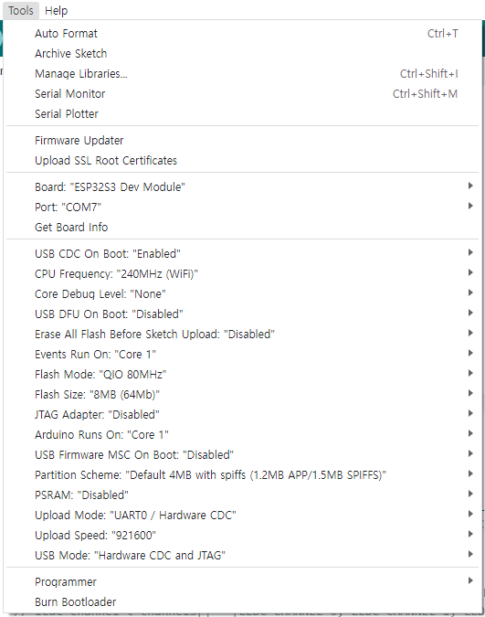

# BLE Firmware for BB-MINI
BLE를 이용해서 BitblockAI와 연결하는 아두이노 펌웨어

## History
##### 2023-11-29 
- Andorid v1.3.0와 Electron v1.3.0 버전 동작 확인 중...
##### 2023-12-08 
- BLE Power 높이는 코드 추가 
- https://github.com/taichunmin/line-simplebeacon-esp32/blob/master/sample/sample.ino

### 2024-05-05  
- 아두이노IDE 보드매니저 ESP라이브러리 2.0.16으로 업데이트 
- 현재까지는 컴파일에 문제가 없는데...
  
  
```
/**
 * Bluetooth TX power level(index), it's just a index corresponding to power(dbm).
 * * ESP_PWR_LVL_N12 (-12 dbm)
 * * ESP_PWR_LVL_N9  (-9 dbm)
 * * ESP_PWR_LVL_N6  (-6 dbm)
 * * ESP_PWR_LVL_N3  (-3 dbm)
 * * ESP_PWR_LVL_N0  ( 0 dbm)
 * * ESP_PWR_LVL_P3  (+3 dbm)
 * * ESP_PWR_LVL_P6  (+6 dbm)
 * * ESP_PWR_LVL_P9  (+9 dbm)
 */
```
  
- 블투 파워업...  
  
```
void setup() {
    BLEDevice::init("BitBlockAI");
    esp_ble_tx_power_set(ESP_PWR_LVL_N3);
}

void loop() {
    ...
}
```
  
  
- 가속도 센서
MPU6050_tockn 라이브러리의 소스를 수정
getTiltDown, getTiltUp.함수 추가 
  
```c
bool MPU6050::TiltRight()
{
	float x = angleX;

	if (x > 20 && x < 90 )
	{
		return 1;
	}
	else
	{
		return 0;
	 }
}


bool MPU6050::TiltLeft()
{
	float x = angleX;

	if (x > -90 && x < -20 )
	{
		return 1;
	}
	else
	{
		return 0;
	 }
}


bool MPU6050::TiltUp()
{
	float y = angleY;

	if (y > 20 && y < 90 )
	{
		return 1;
	}
	else
	{
		return 0;
	 }
}

bool MPU6050::TiltDown()
{
	float y = angleY;

	if (y > -90 && y < -20 )
	{
		return 1;
	}
	else
	{
		return 0;
	 }
}
```

## RTOS Task for Arduino
아두이노에서 RTOS의 Task를 사용하기 위한 방법 

-  [ESP32 Arduino 문서](https://docs.espressif.com/projects/arduino-esp32/en/latest/migration_guides/2.x_to_3.0.html)   
-  Task사용법은 [ESP32 Arduino: Creating a FreeRTOS task](https://techtutorialsx.com/2017/05/06/esp32-arduino-creating-a-task/) 참조
-  외부에서 Task를 멈추게 하는 방법 [Multitasking on ESP32 with Arduino and FreeRTOS](https://simplyexplained.com/blog/multitasking-esp32-arduino-freertos/) 참조   
-  아두이노의 TaskSchedule 라이브러리를 사용하는 방법 [Arduino: TaskScheduler, no more millis or delay](https://www.electrosoftcloud.com/en/arduino-taskscheduler-no-more-millis-or-delay/)

```c
// RC CAR START -------------------------------
// MOTOR --------------------------------------
#define LEFT_MOTOR_DIR_PIN    12
#define RIGHT_MOTOR_DIR_PIN   11

#define LEFT_MOTOR_PWM_PIN    13
#define RIGHT_MOTOR_PWM_PIN   46

#define LEFT_MOTOR_FREQ       1000
#define RIGHT_MOTOR_FREQ      1000

#define LEFT_MOTOR_PWM_CHANNEL   6		// 채널은 0 ~ 7
#define RIGHT_MOTOR_PWM_CHANNEL  7

#define LEFT_MOTOR_PWM_ROSOLUTION  8
#define RIGHT_MOTOR_PWM_ROSOLUTION 8
// Line Sensor ---------------------------------
#define LINE_LED_ONOFF_PIN        18
#define LEFT_LINE_SENSOR_PIN      8
#define CENTER_LINE_SENSOR_PIN    6
#define RIGHT_LINE_SENSOR_PIN     4
// Distance -----------------------------------
#define SONIC_ECHO_PIN    5
#define SONIC_TRIG_PIN    39
#define MAX_DISTANCE      200
// RC CAR END ----------------------------------


// BbBoard.h
#ifndef BBBOARD_H
#define BBBOARD_H

// #include "BbMatrix.h"  
// #include "BbSwitch.h"
// #include "BbBuzzer.h"
// #include "BbTouch.h"
// #include "BBServo.h"
// 2024.04.18 P4, P11의 GPIO번호 바꿈 
//----------------------------------------
//      SENSOR        
//----------------------------------------
#define BUZZZER     15  // P번호 없슴
#define MPU_SDA     14  // P20
#define MPU_SCL     21  // P19
#define LED_PIN     38  // P8
#define SWITCH_A    40  // P5
#define SWITCH_B    41  // P6
#define TOUCH_0     10  // P0
#define TOUCH_1     4   // P1
#define TOUCH_2     8   // P2
#define MIC_IN      1   // P번호 없슴
#define LIGHT_1     9   // P번호 없슴
#define LIGHT_2     7   // P번호 없슴
#define SERVO       16  // P번호 없슴, 본체 서보모터 
//----------------------------------------
//  BB-mini   -> MICRO::BIT
//----------------------------------------

#define P0    10    //  TOUCH1    -> ANALOG IN
#define P1    4     //  TOUCH3    -> ANALOG IN
#define P2    8     //  TOUCH2    -> ANALOG IN
#define P3    2     //  ADC0      -> ANALOG IN 
// #define P4    9     //  LIGHT_1   -> ANALOG IN
#define P4    47
#define P5    40    //  SWITCH_A  -> BUTTON A
#define P6    41    //  SWITCH_B  ->
#define P7    39    //
#define P8    38    //  LED_PIN   ->
#define P9    5     //            -> ADC4, ANALOG IN 
#define P10   6     //            -> ADC3, ANALOG IN
// #define P11   7     //  LIGHT_1   -> ADC2
#define P11   48
#define P12   18    //
#define P13   12    //            -> SCK
#define P14   13    //            -> MISO
#define P15   11    //            -> MOSI
#define P16   46    //
#define P19   21    //            -> SCL
#define P20   14    //            -> SDA
#define P99   99    //  DUMMY PIN

#define LED_PIN   38
#define LED_COUNT 25

struct RGB {
  uint8_t r;
  uint8_t g;
  uint8_t b;

  RGB(uint8_t red, uint8_t green, uint8_t blue) {
    r = red;
    g = green;
    b = blue;
  }
};


#endif

```


### 아두이노 업로드 설정 

